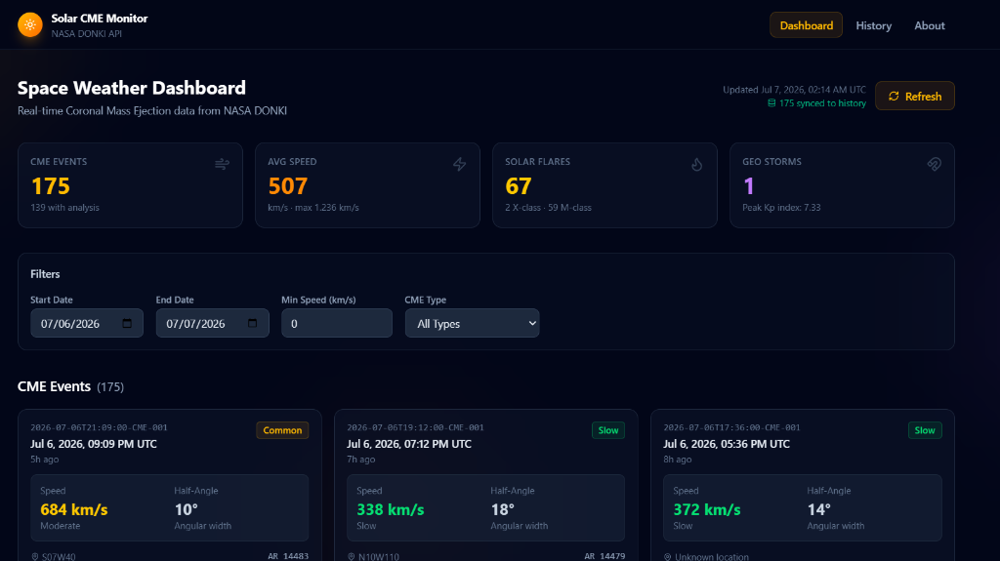
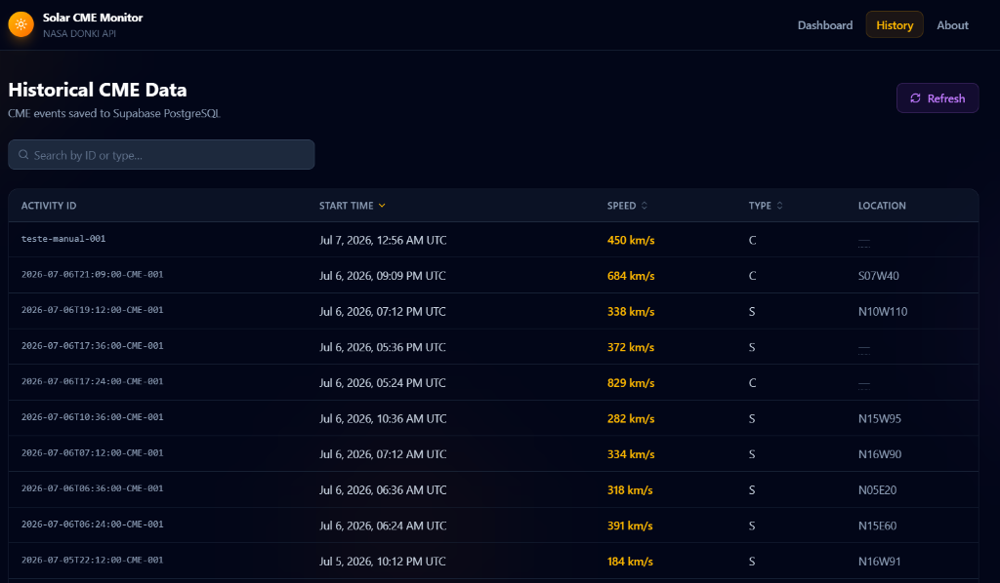

# Solar CME Monitor


> **Status: Under active development.**

Solar CME Monitor is a web application built with React that provides an interface for searching, visualizing, and persisting data about **Coronal Mass Ejection (CME)** events sourced from NASA's DONKI API.

The project was developed for educational purposes, with a focus on API integration, modern frontend architecture, and cloud database usage.

**Live:** [solar-cme-monitor.vercel.app](https://solar-cme-monitor.vercel.app)
**Repository:** [github.com/nasa-cme/cme-dashboard](https://github.com/nasa-cme/cme-dashboard)

---

## Screenshots

### Dashboard



### History



---

## Table of Contents

- [About](#about)
- [Features](#features)
- [Technology Stack](#technology-stack)
- [Architecture](#architecture)
- [Project Structure](#project-structure)
- [Getting Started](#getting-started)
- [Environment Variables](#environment-variables)
- [Deployment](#deployment)
- [Roadmap](#roadmap)
- [License](#license)

---

## About

Coronal Mass Ejections are large-scale eruptions of magnetized plasma from the Sun's corona. Solar CME Monitor provides a clean interface for querying this data from NASA's Space Weather Database Of Notifications, Knowledge, Information (DONKI) API, displaying relevant event attributes, and storing results in a Supabase PostgreSQL database for persistence and performance.

---

## Features

- Query CME events by date range via the NASA DONKI API
- Display event details including source location, speed, and classification
- Persist event records and search history in Supabase
- Server-side NASA API key injection through a Supabase Edge Function (`donki-proxy`), keeping the key out of the client bundle
- Responsive layout with support for mobile and desktop viewports
- Graceful error handling for API failures and empty result sets

---

## Technology Stack

| Layer | Technology |
|---|---|
| UI Framework | React 18 |
| Build Tool | Vite |
| Language | JavaScript (ES6+) |
| Styling | Vanilla CSS |
| Database | Supabase (PostgreSQL) |
| Edge Functions | Supabase Edge Functions (Deno / TypeScript) |
| External API | NASA DONKI API |
| Deployment | Vercel |
| CI/CD | GitHub Actions |
| Version Control | Git / GitHub |

---

## Architecture

The application uses a client-centric architecture. The React frontend communicates with two external services: the NASA DONKI API (proxied through a Supabase Edge Function) and the Supabase database.

```
                        Client Browser
                              |
                              |
                     React Application
                              |
              ┌───────────────┴───────────────┐
              |                               |
    Supabase Edge Function              Supabase Database
       (donki-proxy)                   (PostgreSQL / RLS)
              |                               |
     NASA DONKI API                   Persisted CME data
              |                         Search history
       CME event data
```

### React Application

Handles all UI rendering, user interaction, state management, and data processing. Organized into pages, reusable components, custom hooks, and service modules.

### Supabase Edge Function — `donki-proxy`

Acts as a server-side proxy to the NASA DONKI API. The NASA API key is stored as a Supabase secret and injected at runtime, so it is never exposed to the client. The app falls back to NASA's `DEMO_KEY` (30 requests/hour) if no key is configured.

### Supabase Database

Stores CME event records and search history. Row-Level Security (RLS) is enabled; the anon key used client-side does not grant unrestricted access.

**Table: `cme_events`**

| Column | Type | Description |
|---|---|---|
| id | uuid | Primary key |
| activity_id | text | DONKI activity identifier |
| start_time | timestamptz | Event start time |
| source_location | text | Solar coordinates |
| note | text | Event description |
| created_at | timestamptz | Record insertion timestamp |

**Table: `search_history`**

| Column | Type | Description |
|---|---|---|
| id | uuid | Primary key |
| start_date | date | Query start date |
| end_date | date | Query end date |
| results_count | integer | Number of results returned |
| searched_at | timestamptz | Search timestamp |

---

## Project Structure

```
solar-cme-monitor/
├── public/
│
├── src/
│   ├── components/
│   │   ├── cme/           # CMECard, CMEList, CMEFilters, CMEStats
│   │   ├── layout/        # Header, Footer
│   │   └── ui/            # Badge, Card, LoadingSpinner, TableSkeleton, ErrorBoundary
│   │
│   ├── hooks/             # useCMEData, useFilters, useDebounce, useSupabase
│   │
│   ├── pages/              # Dashboard, History, About
│   │
│   ├── services/           # api.js, supabase.js
│   │
│   ├── utils/              # constants.js, formatters.js, matchAnalysis.js, retry.js
│   │
│   ├── App.jsx
│   ├── main.jsx
│   └── index.css
│
├── supabase/
│   ├── functions/
│   │   └── donki-proxy/    # Edge Function (TypeScript / Deno)
│   └── migrations/         # SQL migration files
│
├── .env.example            # Environment variable template (committed)
├── .env.local              # Real credentials (git-ignored)
├── .gitignore
├── package.json
├── vite.config.js
└── README.md
```

---

## Getting Started

### Prerequisites

- Node.js 18 or higher
- A Supabase project (for database and Edge Function features)
- A NASA API key — request one at [api.nasa.gov](https://api.nasa.gov)

### Installation

Clone the repository:

```bash
git clone https://github.com/nasa-cme/cme-dashboard.git
cd cme-dashboard
```

Install dependencies:

```bash
npm install
```

Configure environment variables (see [Environment Variables](#environment-variables)).

Start the development server:

```bash
npm run dev
```

The application will be available at `http://localhost:5173`.

---

## Environment Variables

Copy `.env.example` to `.env.local` and fill in your values. The `.env.local` file is git-ignored and must never be committed.

```bash
cp .env.example .env.local
```

| Variable | Description |
|---|---|
| `VITE_SUPABASE_URL` | Your Supabase project URL |
| `VITE_SUPABASE_ANON_KEY` | Your Supabase anon/public key |

The NASA API key is not required in the client environment. It is stored as a Supabase secret and injected server-side by the `donki-proxy` Edge Function:

```bash
supabase secrets set NASA_API_KEY=your_nasa_api_key
```

---

## Deployment

The application is deployed on **Vercel**, connected to this repository. Every push to the `main` branch triggers an automatic production deployment.

**Production URL:** [solar-cme-monitor.vercel.app](https://solar-cme-monitor.vercel.app)

Environment variables (`VITE_SUPABASE_URL`, `VITE_SUPABASE_ANON_KEY`) are configured in the Vercel project settings under *Settings > Environment Variables*.

To deploy manually using the Vercel CLI:

```bash
npm install -g vercel
vercel login
vercel --prod
```

---

## Roadmap

- ~~Interactive charts for CME frequency and speed over time~~ *(implemented — Recharts)*
- ~~Dashboard with aggregated statistics~~ *(implemented — CMEStats + CMECharts)*
- Advanced filtering by CME type and speed range
- CSV export for query results
- Performance improvements for large date range queries
- Mobile UI refinements


## License

This project was developed for educational purposes. No license is currently applied.
